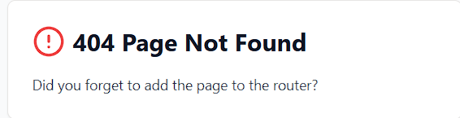
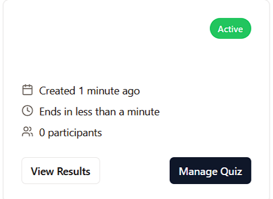
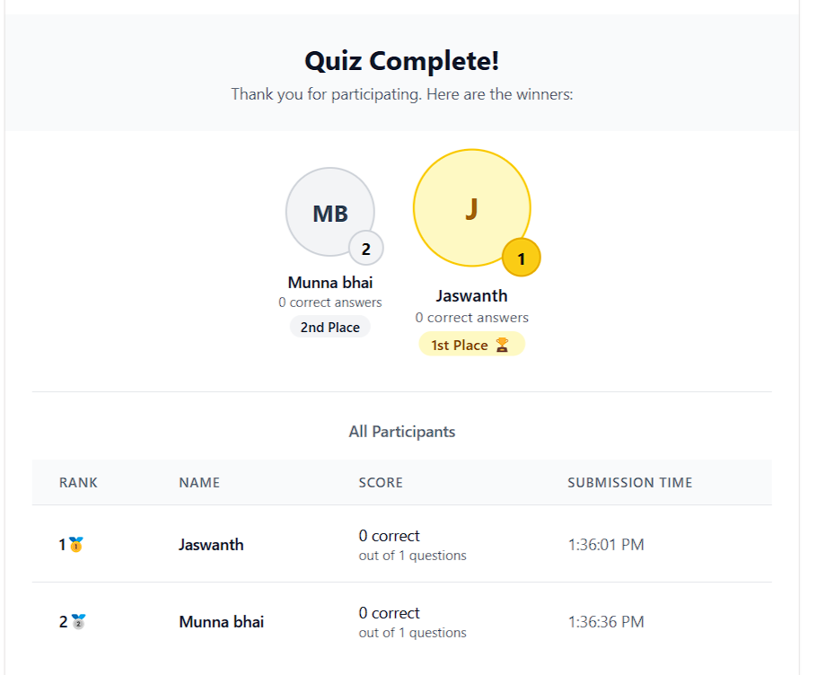

# QuizMaster - Interactive Quiz Game Platform
## Comprehensive Project Documentation

### Table of Contents
1. [Project Overview](#project-overview)
2. [Technical Architecture](#technical-architecture)
3. [Features & Functionality](#features--functionality)
4. [User Interface](#user-interface)
5. [Technical Implementation](#technical-implementation)
6. [Security & Performance](#security--performance)
7. [Future Enhancements](#future-enhancements)

## Project Overview

QuizMaster is a modern web-based interactive quiz platform designed to facilitate real-time quiz sessions between hosts and participants. The platform supports multiple quiz formats and provides instant feedback and winner announcements.

### Core Objectives
- Enable quiz creation and management
- Support real-time participation
- Provide instant scoring and winner determination
- Facilitate easy sharing and access

## Technical Architecture

### Technology Stack
- **Frontend**: React 18 with TypeScript
- **UI Framework**: Tailwind CSS with shadcn/ui components
- **Backend**: Node.js with Express
- **Database**: SQL with Drizzle ORM
- **Real-time Communication**: WebSocket
- **State Management**: React Query
- **Routing**: Wouter
- **Authentication**: JWT-based auth

### System Architecture
```
├── client/                 # Frontend React application
│   ├── src/
│   │   ├── components/    # Reusable UI components
│   │   ├── hooks/        # Custom React hooks
│   │   ├── lib/          # Utility functions
│   │   └── pages/        # Route components
├── server/                # Backend Express application
│   ├── routes.ts         # API endpoints
│   ├── websocket.ts      # WebSocket handler
│   └── db.ts            # Database configuration
└── shared/               # Shared TypeScript types
```

## Features & Functionality

### Host Features
1. **Quiz Creation**
   - Subject and section definition
   - Game mode selection (Single/Multi-choice)
   - Prize allocation (up to 5 places)
   - Start/End time configuration

2. **Quiz Management**
   - Real-time monitoring
   - Results management
   - Participant tracking

3. **Sharing Options**
   - QR Code generation
   - Direct link sharing
   - Email/WhatsApp integration

### Player Features
1. **Quiz Participation**
   - Easy access via link/QR code
   - Real-time answer submission
   - Instant feedback

2. **Results View**
   - Position tracking
   - Score display
   - Winner announcements

## User Interface

### Authentication Page

The authentication page provides a clean interface for user login and registration.

### Host Dashboard

The dashboard offers comprehensive quiz management capabilities.

### Quiz Creation

Intuitive interface for creating new quiz sessions.

### Player View

Clean and responsive interface for quiz participants.

### Winner Announcement

Engaging winner announcement display with sharing capabilities.

## Technical Implementation

### Frontend Architecture
- **Component Structure**: Modular components using React functional components and hooks
- **State Management**: Mix of React Query for server state and local state for UI
- **Styling**: Tailwind CSS with custom theme configuration
- **Real-time Updates**: WebSocket integration for live updates

```typescript
// Example WebSocket Hook Implementation
export function useWebSocket(url: string) {
  const [socket, setSocket] = useState<WebSocket | null>(null);
  
  useEffect(() => {
    const ws = new WebSocket(url);
    setSocket(ws);
    return () => ws.close();
  }, [url]);
  
  return socket;
}
```

### Backend Architecture
- **RESTful API**: Express.js with TypeScript
- **Database**: SQL with Drizzle ORM for type safety
- **WebSocket Server**: Custom implementation for real-time features
- **Authentication**: JWT-based with secure session management

### Security Features
1. **Authentication & Authorization**
   - JWT token validation
   - Role-based access control
   - Session management

2. **Data Protection**
   - Input validation
   - XSS protection
   - CSRF prevention

3. **API Security**
   - Rate limiting
   - Request validation
   - Error handling

## Performance Optimizations
1. **Frontend**
   - Code splitting
   - Lazy loading
   - Optimized builds

2. **Backend**
   - Caching strategies
   - Database indexing
   - Connection pooling

## Future Enhancements
1. **Feature Additions**
   - Advanced analytics
   - More quiz formats
   - Social features

2. **Technical Improvements**
   - PWA support
   - Offline capabilities
   - Performance optimizations

3. **Integration Possibilities**
   - LMS integration
   - Social media sharing
   - Custom branding options

## Conclusion
QuizMaster represents a robust and scalable solution for interactive quiz management. Its modern architecture and comprehensive feature set make it suitable for various use cases, from educational institutions to corporate training programs.
